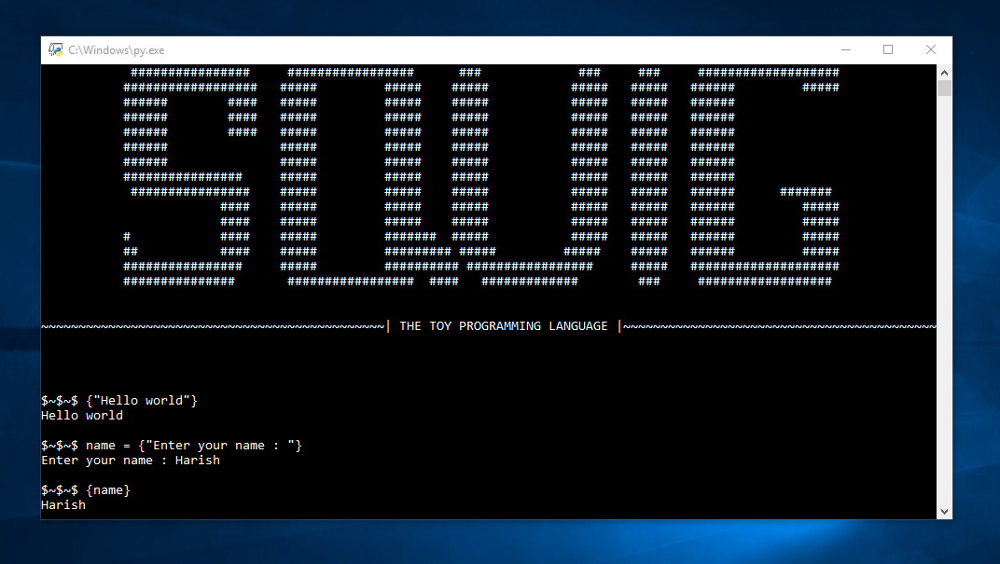

# squig

A programming language syntactically similar to python & which provides core functions.

developing...

# Example :
    
    age = int(input("Enter your age :"))
    print(age)
    
The above python code can be written in squig as follows. 
   
    age = i{"Enter your age : "}
    {age}
    
# Example :
 
